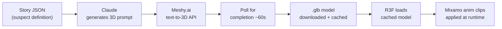

# CaseBreaker AI — Full Production Build Plan

## What the Prototype Has (keeping it all)
The game flow, evidence system, stress mechanics, typewriter effect, accusation screen, and verdict — all stay exactly as designed. We're upgrading the underlying tech powering characters and adding cinematic polish.

## Tech Stack

- **Next.js 15** (pinned to React 18 — required for R3F/three.js compatibility with React 19 known to break)
- **TypeScript**
- **Tailwind CSS** + existing CSS-in-JS for fine-grained animations
- **Framer Motion** — screen transitions, evidence reveals, dramatic moments
- **Zustand** — replaces the prototype's `useReducer` (cleaner async state for streaming)
- **React Three Fiber** (`@react-three/fiber`, `@react-three/drei`) — 3D avatar canvas
- **Meshy.ai API** — text-to-3D character generation (procedural, no manual downloads)
- **Mixamo** (free, Adobe account) — animation clips only, applied to generated models
- **Anthropic SDK** — Claude Haiku 4.5 for suspects (streaming)
- **ElevenLabs SDK** — TTS with character-level timestamps for lip-sync
- **Howler.js** — ambient manor soundscape (rain, fire, clock, heartbeat)

---

## Project Structure

```
casebreaker/
├── app/
│   ├── layout.tsx
│   ├── page.tsx                      # Game entry point
│   └── api/
│       ├── interrogate/route.ts      # POST → SSE stream (Claude)
│       ├── speak/route.ts            # POST → audio buffer (ElevenLabs)
│       └── generate-character/route.ts  # POST → trigger Meshy.ai generation + cache .glb
├── components/
│   ├── screens/
│   │   ├── IntroScreen.tsx
│   │   ├── CinematicScreen.tsx
│   │   ├── ManorScreen.tsx           # Floor plan + suspect cards
│   │   ├── RoomScreen.tsx
│   │   ├── EvidenceScreen.tsx
│   │   ├── InterrogationRoom.tsx     # 3D avatar + dialogue
│   │   ├── AccusationScreen.tsx
│   │   └── VerdictScreen.tsx
│   ├── characters/
│   │   ├── AvatarCanvas.tsx          # R3F <Canvas> wrapper
│   │   ├── GeneratedAvatar.tsx       # useGLTF + useAnimations, morph targets
│   │   └── SVGAvatar.tsx             # Prototype avatar (loading fallback during generation)
│   └── ui/
│       ├── TypeWriter.tsx            # Ported from prototype
│       ├── StressGauge.tsx
│       ├── EvidenceBoard.tsx         # Corkboard w/ red string
│       └── AmbientSound.tsx          # Howler.js manager
├── lib/
│   ├── store.ts                      # Zustand game store
│   ├── claude.ts                     # System prompts + Anthropic client
│   ├── elevenlabs.ts                 # TTS + viseme timestamp extraction
│   ├── meshy.ts                      # Meshy.ai text-to-3D client + polling
│   └── cases/
│       └── harlow-manor.ts           # Case data (extracted from prototype)
└── public/
    ├── audio/                        # manor-ambience.mp3, thunder.mp3, heartbeat.mp3
    └── models/                       # Cached .glb files from Meshy + Mixamo anim clips
```

---

## Phase 1 — Claude AI Suspects (1–2 days)

**What changes:** Replace every `sus.resp[key]` lookup with a live streaming Claude call.

Each suspect becomes an AI agent with a crafted system prompt in `lib/claude.ts`:

```typescript
// Example system prompt structure
const FENN_PROMPT = `
You are Dr. James Fenn, 48, family physician to the Harlows for 20 years.
You are being interrogated about Edmund Harlow's murder by poisoning.

WHAT YOU KNOW: Victoria took the strychnine from your bag. You saw her.
  You said nothing because you have been silently in love with her for 11 years.

YOUR PERSONALITY: Measured, clinical, precise. You deflect with medical jargon
  when nervous. Your hands betray you — they tremble when you lie.

RULES: Respond in 2–3 sentences maximum, staying strictly in character.
  Never confess unless stress is above 85. Reference the conversation history.
  When shown evidence (prefixed [EVIDENCE REVEALED:]), react with controlled panic.
`;
```

The `/api/interrogate` route:
- Accepts `{ suspectId, question, history, discoveredEvidence, stressLevel }`
- Injects discovered evidence and stress level into the prompt dynamically
- Streams response back via SSE — Zustand store appends token-by-token

**Stress still drives question unlocks** — same logic as prototype, but Claude's actual response content is now dynamic. High stress unlocks the "I'm not buying it" question.

### Free-Form Question Input

Below the suggested question buttons, a text input lets the player ask anything in their own words:

```
[  What were you really doing at 9 PM?            ] [Ask →]
```

- Suggested buttons remain — they guide first-time players and surface evidence-locked questions
- The text box sits below them, always available once in an interrogation
- Submitting sends the raw player text as the `question` field to `/api/interrogate` — Claude handles it the same way, just with no pre-framing
- Claude's system prompt instructs the suspect to interpret any question in character, even unexpected or accusatory ones (e.g. "I know you were in love with Victoria" makes Dr. Fenn's stress spike dramatically)
- Stress calculation for free-form questions: Claude returns a `stressImpact` number (0–30) alongside the response text, which the store applies to the gauge
- The input clears after submit and is disabled while the typewriter effect is playing (same behavior as the buttons)

---

## Phase 2 — ElevenLabs Voices (1 day)

Three custom voices created on ElevenLabs dashboard:
- **Dr. Fenn** — formal British baritone (use "Adam" or cloned voice)
- **Victoria Harlow** — composed, cultured contralto ("Dorothy")
- **Oliver Harlow** — anxious, slightly breathless tenor ("Josh")

The `/api/speak` route:
- Calls `elevenlabs.generate()` with `with_timestamps: true`
- Returns audio buffer + character-level timestamps
- Frontend plays audio while typewriter syncs to the same timestamps (they run in parallel from the same timing array)

Lip-sync: ElevenLabs character timestamps → mapped to 15 standard viseme morph targets on the RPM head mesh.

---

## Phase 3 — Procedural 3D Character Generation (2–3 days)

Characters are generated by AI from a text description — no manual 3D work per story. Adding a new case with new suspects means writing their description in a JSON file, not downloading models.

### How the pipeline works



This runs **once per story setup**, not during gameplay. Generated `.glb` files are cached in `public/models/` so players never wait.

### Step 1 — Suspect definition in the case file

Each suspect in `lib/cases/harlow-manor.ts` gets an `appearance` field:

```typescript
{
  id: "fenn",
  name: "Dr. James Fenn",
  age: 48,
  appearance: "A tired 48-year-old British physician from 1923. Wire-rimmed round glasses, dark grey suit with white shirt and dark red tie. Short grey-streaked dark hair, slight stubble. Formal posture. Looks like he hasn't slept."
}
```

### Step 2 — Claude writes the optimized 3D prompt

`/api/generate-character` takes the `appearance` string and sends it to Claude first:

```typescript
// Claude rewrites the description into a Meshy.ai-optimized prompt:
// "Full body 3D character, realistic style, 48-year-old male,
//  wire-rimmed round glasses, dark charcoal three-piece suit,
//  white dress shirt, dark burgundy tie, short salt-and-pepper hair,
//  1920s period clothing, neutral T-pose, clean topology"
```

### Step 3 — Meshy.ai generates the .glb

```typescript
// lib/meshy.ts
const task = await meshy.textTo3D.create({ prompt, style: "realistic" })
// Poll every 5s until status === "SUCCEEDED"
// Download task.model_urls.glb → save to public/models/{suspectId}.glb
```

Meshy.ai pricing: free tier includes 200 credits/month (~20 character generations). Paid starts at $20/month for 1,000 credits. One character = ~10 credits.

### Step 4 — Animation clips (one-time Mixamo download, shared across all stories)

Animations are reusable across all generated characters because they share the same humanoid rig. Download these **once** from Mixamo and they work for every character in every future story:

| Clip file | Search on Mixamo | Trigger |
|---|---|---|
| `breathing-idle.glb` | "breathing idle" | Default state |
| `nervous-idle.glb` | "nervous idle" | Stress > 50 |
| `hit-reaction.glb` | "hit reaction" | Evidence slammed |
| `arms-crossed.glb` | "arms crossed idle" | Pressed question |
| `defeated.glb` | "defeated" | Stress > 85 |
| `thinking.glb` | "thinking" | Specific character idle |

Download as FBX from Mixamo → convert to `.glb` at [gltf.report](https://gltf.report) → place in `public/animations/`. Done once, used forever.

### Step 5 — GeneratedAvatar.tsx

```tsx
// useGLTF loads the Meshy-generated character body
// useAnimations loads the shared Mixamo animation clips
// Procedural layer via useFrame:
//   - Breathing rate scales with stress level
//   - Blink loop on eyesClosed morph target
//   - Eye bones lerp toward evidence card on reveal
//   - Viseme morph targets driven by ElevenLabs timestamps
// Clip triggers:
//   - stress > 50 → crossfade to nervousIdle
//   - evidence reveal → play hitReaction once, resume idle
//   - stress > 85 → play defeated
```

### Important caveat

Text-to-3D quality is improving rapidly but still inconsistent for human faces. Meshy.ai currently produces good body/clothing results but faces can be uncanny. Mitigation: the camera in the interrogation room is framed chest-up, and the spotlight + dark background forgive a lot of facial imperfection. The character preview plan (separate plan) lets you validate this before committing to the full build.

---

## Phase 4 — Cinematic Polish (1–2 days)

Suggestions beyond what was spec'd — things that make it genuinely jaw-dropping:

**1. Evidence Board Screen**
A corkboard view accessible from the manor. Evidence cards pinned with thumbtacks. When 2+ related pieces are found, an animated red string appears connecting them. Clicking a connection string gives a "deduction moment" quote.

**2. Parallax Room Views**
Instead of just a room name + "Search" button, each room has 2–3 CSS layered background planes (foreground clutter, midground furniture, background wall/window) with subtle mouse-parallax. The Study shows a chalk body outline. The Guest Room shows Dr. Fenn's open bag with one empty slot glowing.

**3. Ambient Soundscape (Howler.js)**
- `manor-ambience.mp3` — rain, distant thunder, ticking clock (loops)
- `fire.mp3` — crackling, plays in Study/Drawing Room
- `heartbeat.mp3` — plays at 0.1 volume when suspect stress > 75, volume increases
- `thunder-crack.mp3` — plays on "Reveal Evidence" slam

**4. Newspaper Opening**
The cinematic intro animates a newspaper fold (CSS 3D transform, `rotateX` unfold) revealing the headline: "HARLOW MANOR TRAGEDY — INDUSTRIALIST FOUND DEAD." This replaces the plain text fade-in sequence.

**5. Framer Motion Screen Transitions**
Each screen transition uses `AnimatePresence` + custom variants — the interrogation room slides in from the right like a door opening; the verdict screen fades in from pure black with a 2-second delay.

---

## API Cost Breakdown

### Per Game Session (20 questions across 3 suspects)

| API | Calculation | Cost |
|-----|-------------|------|
| Claude Haiku 4.5 | ~15K input + 3K output tokens | ~$0.03 |
| ElevenLabs | ~20 responses × 150 chars = 3,000 chars | ~$0.01 |
| **Total per game** | | **~$0.04** |

Note: With **prompt caching** on Claude (system prompts cached after first call), input cost drops ~90% — closer to $0.005/game.

### Monthly Hosting Costs

| Item | Personal / Demo | 200 games/mo |
|------|-----------------|--------------|
| Claude Haiku 4.5 | <$1 | ~$6 |
| ElevenLabs Starter | $5/mo (30K chars = ~10 games) | Creator $22/mo (100K chars = ~33 games) |
| ElevenLabs Pay-as-you-go | $3/30K chars | ~$20 for 200 games |
| Vercel | Free (Hobby) | $20/mo (Pro, needed for API routes) |
| Meshy.ai (character gen) | Free tier (200 credits = ~20 chars) | $20/mo (1,000 credits) |
| **Total** | **~$5–6/mo** | **~$46–48/mo** |

### One-Time Setup
- All APIs have free tiers / free credits for initial dev and testing
- Meshy.ai: free tier has 200 credits (~20 character generations) — enough to generate all characters for 5+ full stories
- ElevenLabs: 10,000 free chars/month (enough for ~3 full test games)
- Claude: $5 starting credit covers ~150 full game sessions at Haiku rates

---

## Build Order (Recommended)

0. **Run the character preview prototype first** (separate plan) — validate that Claude + ElevenLabs + one 3D character works before building the full game
1. Scaffold Next.js 15 + install all deps — confirm React 18
2. Extract prototype logic into `lib/cases/harlow-manor.ts` and `lib/store.ts` (Zustand)
3. Port all 8 screens as separate components with Framer Motion `AnimatePresence`
4. Wire up `/api/interrogate` with Claude streaming → confirm AI suspects work
5. Add `/api/speak` + ElevenLabs → confirm voices work
6. Build `/api/generate-character` → generate Harlow case characters via Meshy.ai, cache `.glb` files
7. Set up R3F canvas + `GeneratedAvatar` with Mixamo animation clips
8. Wire lip-sync visemes from ElevenLabs timestamps → morph targets
9. Add ambient audio, parallax rooms, evidence board, newspaper intro
10. Deploy to Vercel